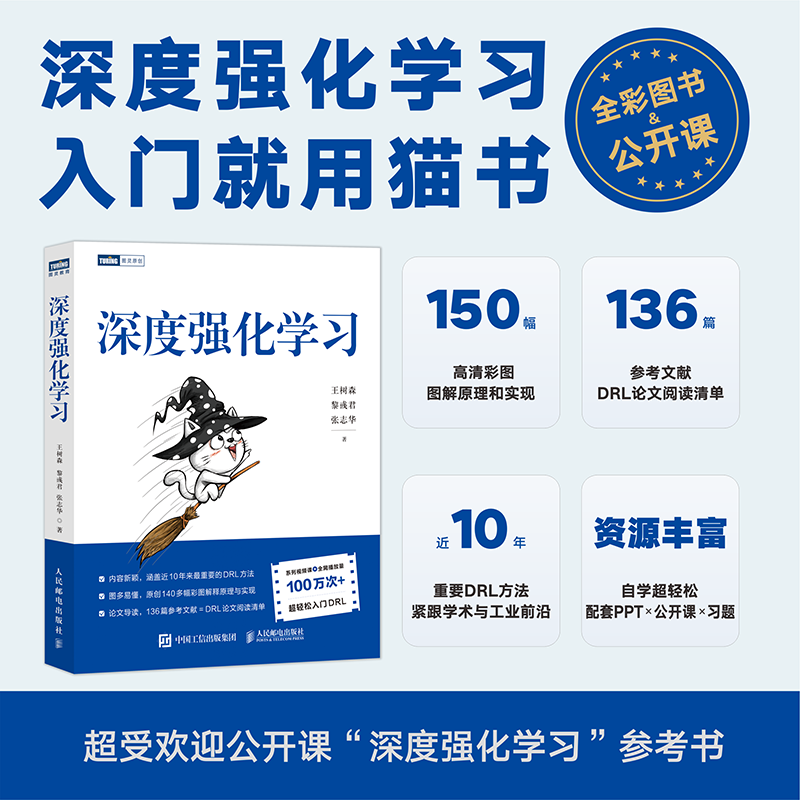

#  王树森、黎彧君、张志华经典之作《深度强化学习》正式出炉 + 赠书活动

> 推荐语：这是一本正式出版前就注定成为经典的书——其在线公开课视频播放量超过一百万次，帮助数万对深度强化学习这一前沿主题感兴趣的“云学生”——更加高效、方便、系统地学习和应用相关知识。在大家翘首以盼数载，望穿秋水之时，本书终于正式出炉！本书地址(包含课件、视频、PDF初稿)：https://github.com/wangshusen/DRL ，王树森B站：https://space.bilibili.com/1369507485 ，纸质书二维码链接参见文末，请对深度强化学习感兴趣的朋友不要错过！

> 赠书规则：关注本公众号并在本文后留言（内容关于学习“深度强化学习”的困惑、经验、经历等）。我们会邀请本书作者、大家的“云老师”王树森博士来根据留言，亲自选出10位更想学深度强化学习的朋友，送出10本纸质正版书。免费包邮！欢迎扩散！截止时间本周日（2022年12月4日）晚22点。注：本次赠书的资金全部由作者王树森个人承担。[注：非常抱歉，多次交锋，本书读者、统计之都几位志愿者编辑还是没有抢赢树森来为大家请客读书，树森说不差钱！嗯，他们或许不及树森阔气，但仍可以另择良辰吉日赠送此书，敬请大家期待！]

# 序言：格物致知，知行合一  

强化学习研究序贯决策问题，它同监督学习、无监督学习一起构成机器学习的三大学习范式。强化学习像无监督学习一样不存在有标签的训练集，但它通过与环境交互并在奖惩制度的不断刺激下驱使系统学习如何最大化自己的利益或最小化自己的损失，这也与被动地获得有标签训练数据集的监督学习场景不同。强化学习植根于人工智能领域，但它与最优控制、运筹学、随机规划有着紧密的联系。它们都试图克服经典动态规划求解高维问题所面临的“维数诅咒”问题。   

现代强化学习主要基于随机模拟思想，它的奠基性工作始于1989年Chris Watkins提出的Q学习方法。人工神经网络作为一种函数逼近技术自然被引入强化学习，由此，Dimitri Bertsekas和John Tsitsiklis (1996)提出了神经动态规划的概念。随着深度神经网络的突破性崛起，强化学习得以“深度强化学习”而复兴。深度学习和强化学习构成现代人工智能技术的两翼。深度学习提供了一种强大的数据表示或函数逼近途径，而强化学习则提供了一种求解问题的方法论或技术路线的通用途径。 

我本人于2017年在北京大学开始讲授深度学习，次年又讲授强化学习。虽然这两门课都有非常经典的教材供参考，但是讲授难度还是比较大---既需要兼顾数学原理和动手实践，又需要兼顾经典方法和前沿成果。特别地，深度学习更多是各种方法、技术和应用场景的荟萃，缺乏一条清晰的脉络将知识点串联起来。相对而言，强化学习的数学脉络清晰且较为具体，因为它建立在马尔可夫决策过程基础上，而贝尔曼方程定义了问题求解的最优性准则。然而，强化学习在实践上又不如深度学习有这么丰富的开源平台。 

本书是王树森博士根据自己讲授的深度强化学习课程材料整理而成的（详见前言部分）。本书吸收了强化学习的经典方法和最新的前沿成果，同时兼顾了算法原理和实现，适合于强化学习初学者。由于我也有讲授强化学习课程的经验和体会，我欣然接受了王树森的邀请来一起修订完善书稿。为了帮助读者更好地理解和掌握相关内容，我们又邀请黎彧君博士加入来补充算法程序实现部分。算法开源包是我的博士研究生谢广增、陈昱和黎彧君在研究强化学习过程中陆续实现并整合成的，黎彧君基于PyTorch进行了改写和完善。  

“运用之妙，存乎一心”。强化学习同时提供问题及其解的数学表示方法，集成了数学思维和工程思维。强化学习算法通常包含价值计算和策略调整两个要素，通过“trial-and-error”学习或基于“actor-critic”框架来求解问题，这诠释着知和行一体来寻找问题最优解的思路，暗合了中国儒家修心思想“格物致知，知行合一”。其实，这也是我们做学问的金科玉律。 

张志华

北京大学燕园

2022年7月22日

# 前言

强化学习是机器学习的一个分支，研究如何基于对环境的观测做出决策，以最大化长期回报。从 20 世纪 80 年代至今，强化学习一直是机器学习领域的热门研究方向。大家耳熟能详的经典强化学习方法——Q 学习、REINFORCE、actor-critic——就是 20 世纪 80 年代提出的，一直沿用至今。而经验回放、SARSA、蒙特卡洛树搜索等重要工作是 20 世纪 90 年代和 21 世纪初提出的。最近十年，随着深度学习的发展，强化学习也取得了突破性的进展，并诞生了深度强化学习这一分支。

2012年，卷积神经网络 AlexNet 打赢了 ImageNet 挑战赛，开启了深度学习时代。2013 年诞生了首个深度强化学习方法——深度 Q 网络（DQN），它在 Atari 电子游戏上的表现遥遥领先已有的机器学习方法，但跟人类仍有较大差距。2015 年，改进版的 DQN 在 Atari 电子游戏上的表现大幅领先人类专业玩家，学术界由此认识到了深度强化学习的巨大潜力。2015 年发生了一件更为轰动的事件——AlphaGo 在围棋比赛中以 5:0 击败职业棋手樊麾——这为深度强化学习带来了空前的关注。随后几年深度强化学习取得了许多重要进展，新的方法如雨后春笋般出现，在各种任务上不断刷新纪录。

## 为何写这本书

2017 年我在加州大学伯克利分校做博士后的时候，周围的人总在讨论强化学习，甚至 RISELab 正在开发的新一代机器学习系统 Ray 几乎就是为强化学习量身定制的。虽然当时我的研究方向不是强化学习，但我对它很着迷，并下定决心要学会它。我自认为数学功底和自学能力都很强，花点儿时间应该能学会，可我却在实际学习过程中吃尽苦头，花了几年时间才形成完整的强化学习知识体系。

大家都说 Richard Sutton 和他的老师 Andrew Barto 合著的 Reinforcement Learning: An Introduction是强化学习领域的“圣经”，是初学者必读的书，于是我就从这本书开始入门。可当我读完一大半的时候，发现自己还是听不懂那些研究强化学习的人在说什么，仿佛大家说的“强化学习”与书中所讲的不是一种东西。这时我意识到自己走了弯路，于是及时止损，改读 DQN、DDPG、A3C 等的代码，这回学习效果显著，我逐渐能听懂强化学习的报告了。但靠读代码学习有很大的缺点，知识碎片化严重，我只是略懂具体的一些点，而这些点串不起来。结果就是，我既看不到领域的前沿方向，也读不懂知识背后的原理——感觉自己仍然是个门外汉，没有真正掌握强化学习。

既然没有优质的教材，读代码又过于肤浅，那么可行的路就只有一条——把近几年重要的论文挨个读一遍，把论文里的核心公式推导一遍。这的确是一条正道，通过阅读论文和梳理知识体系，我最终“大彻大悟”——发现深度强化学习的所有方法背后不过就是几个公式的变换而已。读论文虽然是一条正道，但是见效很慢，而且只适合我这样有科研经验的学者，并不适用于初学者。

2018 年我在史蒂文斯理工学院计算机科学系任教之后，心怀忐忑地开了我的第一门课“深度学习”。意外的是，通过教授这门课程，我发现自己在教学方面还算有些“天赋”——能把大量疑难知识快速为初学者讲清楚。在我第二次教这门课的时候，我用最后两周的时间为学生讲解了深度强化学习的核心知识。深度强化学习很难，当时我只是抱着试探的态度去讲，但多数学生居然听明白了，这让我异常兴奋，随后我花费了一些时间用中文录制了深度强化学习部分的课程，并发布到了 YouTube 上（ID：Shusen Wang）。很快，观看量超出了我的预期。截至本书出版之前，虽然我的YouTube账号中文频道的订阅者只有1万多，但视频的观看量已经超过了55万。另外，B站上有不少账号自发传播了该系列视频，其中单个视频最高播放量超过15万。保守估计，“深度强化学习”系列视频的全网播放量超过100万——能带这么多初学者入门深度强化学习，我倍感荣幸。

2020年，我本来计划在大学里再开一门“深度强化学习”的课程，于是花了很多时间仔细梳理这个领域的知识点，做了大量笔记和课件。但后来我打算去工业界发展，只能打消了开新课的念头。只是，长时间精心准备的教学材料就这么浪费了未免太可惜，我心里想：“不如整理出来，写成一本书，或许对初学者很有帮助。”于是，我花三个月整理好了笔记，在 2021 年初发到了 GitHub 上。但这份初稿与我眼中的优质教材还相距甚远。之后，我和我的导师张志华、师弟黎彧君用了一年多的时间对初稿进行修改，到了 2022 年才交付给出版社的编辑。

## 本书目标

深度强化学习是当前学术界最热门的研究领域之一，而且有潜力在工业界落地应用。然而深度强化学习的数学原理深奥，知识体系和发展脉络复杂，入门的难度远高于机器学习其他分支。即便是我这样精通机器学习的博士，初期的学习进度也异常缓慢，付出相当大的代价才构建了完整的知识体系。本书的价值在于学习它能够避免初学者重复我走过的弯路，不走“从理论到理论”和“看代码学算法”这两个极端。

本书面向的受众是有一定深度学习基础的学生和算法工程师。本书假设读者完全不懂强化学习，但具备深度学习的基础知识，比如优化、目标函数、正则、梯度等基本概念；不熟悉深度学习的技术细节和背后理论，但知晓基本常识，比如神经网络的全连接层、卷积层、sigmoid 激活函数、softmax 激活函数的用途。如果你几乎不懂深度学习，也可以阅读本书，但是在理解上会有一定困难。

本书的目标是解释清楚深度强化学习背后的原理，而非简单地描述算法或推导公式。通过学习本书，读者能在短时间内构建完整的知识体系，避免知识碎片化。预计读者在学完本书之后，能轻松看懂深度强化学习的代码，读懂该领域的论文、听懂学术报告，具备进一步自学和深挖的能力。

## 本书特点

前面提到，强化学习最经典的教材非 Reinforcement Learning: An Introduction 莫属。它是学术泰斗 Richard Sutton 和 Andrew Barto 所著，被誉为强化学习的“圣经”。这本书的知识体系完整，但其中很多内容在今天已经不太重要了，而当今最重要的深度强化学习技术却没有囊括其中。如果你是初学者，而有人建议你通过阅读这本书入门，那大概率是在“坑”你，或许他自己压根就没读过这本书。如果你的数学功底够强，咬着牙读完此书，你会发现自己仍然不懂深度强化学习，对最近 10 年的技术突破缺乏基本了解，跟不上学术界的前沿。此书正是当年我入门强化学习读的第一本书，算我当年走过的弯路。如果你有志于做强化学习的科研，不妨先读读我们这本书，之后再读 Sutton和Barto 的书补充理论知识。

本书与 Sutton 和 Barto 的书有类似之处，都是从方法和原理出发讲解强化学习，但是本书有三大优势。第一，内容很新，主要内容是最近 10 年的深度强化学习方法，比如 DQN、A3C、TRPO、DDPG、AlphaGo 等技术。第二，力求实用，本书的写作出发点是“有用”且“精简”，剔除了一切不必要的概念和公式，只保留必要的内容，尽量做到每一个章节都值得阅读。第三，清晰易懂，为了让方法和原理容易理解，我们花了大量时间在文字和绘图上，相信本书在“完读率”方面有显著优势。

当前市面上偏重编程实践的教材很多，这类图书通过讲解代码帮助读者入门深度强化学习。从实践出发不失为一条入门的捷径，但这些书欠缺对方法和原理的解释，同时对数学推导采取回避的态度。这也情有可原，毕竟把代码讲解清楚相对容易，而把方法和原理讲解清楚却很困难！本书的独特之处在于系统地讲解深度强化学习，不回避数学原理，而是用通俗的语言和插图将其解释清楚。如果读者对某些深度强化学习方法有不理解之处，相信可以从本书中找到解答。

对于初学者来说，从方法和原理开始入门，或是从编程实践开始入门，都是合理的选择，主要取决于你想要在这个领域挖多深、走多远。如果你的目标是能看懂代码、“会用”深度强化学习，那么从编程实践入门是很好的选择；如果你的目标是深入理解代码背后的原理、看懂前沿论文甚至从事科研工作，那么建议选择本书。

此外，本书的三位作者都有博士学位，都是机器学习领域的学者。当我和黎彧君还是学生的时候，就在张志华老师的要求下阅读了超过 10 本机器学习领域的经典教材，我们深知什么样的书是好书。而且我们都有多年的学术写作经验，每个人都在机器学习顶会、顶刊上发表过多篇论文。此外，我和张志华老师都有丰富的教学经验，有能力把复杂的方法和原理解释清楚，在严谨的前提下做到通俗易懂。

根据我的教学和写作经验，教学和写作最大的难点不是“大而全”，而是如何把话说明白，让受众以最小的代价听得懂、记得住。假如只是简单罗列知识点、堆公式、堆代码，那么教学和写作的难度非常小。以我的效率，如果按低标准去备一门课或是写一本书，一个暑假绰绰有余；但从开始整理笔记到最终成书，这本书前后用了两年，投入远大于预期。写这本书的过程中，我的精力主要用于确保内容结构清晰、原理与公式易于理解。为了让模型和数学变得直观，我原创了 100 多张简洁精美的插图——有时绘制一张插图就要花费几个小时。回过头来，很难想象，我曾经会以如此大的投入写一本书，期待它能最大限度地降低大家入门深度强化学习的门槛。

## 主要内容

- 第一部分是基础知识，包括机器学习基础、蒙特卡洛方法、强化学习的基本概念。
    - 第 1 章介绍机器学习基础，简要介绍线性模型、神经网络、梯度下降和反向传播。如果读者有不错的机器学习基础，可以跳过这一章。
    - 第 2 章介绍蒙特卡洛方法，其中最重要的知识点是用随机样本近似函数的期望，它是多种强化学习方法的关键所在。
    - 第 3 章介绍强化学习的基本概念，包括马尔可夫决策过程、策略函数、回报、价值函数等重要知识点，需要读者理解并记忆。
- 第二部分是价值学习，介绍 Q 学习和 SARSA 等多种方法。价值学习的目标是学到一个给状态和动作打分的函数，用于基于状态选择最优的动作。
    - 第 4 章介绍 DQN 与 Q 学习，它们是价值学习方法，目标是近似最优动作价值函数。此外，读者需要关注同策略与异策略的区别、目标策略与行为策略的区别，并理解经验回放及其适用范围。
    - 第 5 章介绍 SARSA 与价值网络，它们也是价值学习方法，目标是近似动作价值函数。此外，读者需要深入掌握 TD 目标，并理解自举与蒙特卡洛方法的区别。
    - 第 6 章讲解价值学习的几种高级技巧。经验回放、优先经验回放、目标网络、双 Q 学习都是对 Q 学习的改进。对决网络和噪声网络是对神经网络结构的改进。
- 第三部分是策略学习，包括 REINFORCE、actor-critic、A2C、TRPO、DDPG、TD3 等多种方法。策略学习的目标是学到一个策略函数以最大化回报的期望。
    - 第 7 章详细讲解策略梯度方法，包括 REINFORCE 和 actor-critic。读者应当掌握策略学习的目标函数、策略梯度定理的简化证明，以及 REINFORCE 和 actor-critic 的推导。
    - 第 8 章介绍带基线的策略梯度方法，它们是对 REINFORCE 和 actor-critic 的改进，在实践中效果更好。
    - 第 9 章介绍 TRPO 和熵正则方法。TRPO 来源于数值优化中的置信域方法，用在策略学习上取得了很好的效果。熵正则是策略学习中很常用的技巧，有助于鼓励探索。
    - 第 10 章介绍连续控制，即动作空间是连续集合，主要介绍 DDPG、TD3、随机高斯策略网络这三种连续控制方法。
    - 第 11 章讨论对状态的不完全观测问题，这在实践中很常见。这种问题的有效解决方法是将循环神经网络作为策略函数。
    - 第 12 章介绍模仿学习，它不是强化学习，而是其替代品。之所以把模仿学习放在这一部分，是因为模型学习的目标也是学到策略函数。本章介绍行为克隆、逆向强化学习、生成判别模仿学习这三种方法。
- 第四部分是多智能体强化学习，即多个智能体共享环境，且每个智能体都可以对环境产生影响。可以把本书第二部分、第三部分内容看作单智能体强化学习，而多智能体强化学习是对前者的推广。如果读者对多智能体强化学习不感兴趣，可以跳过这一部分，不影响对第五部分的理解。
    - 第 13 章讲解并行计算及其在深度学习中的应用，本章中的一些基础知识将在多智能体强化学习中用到。
    - 第 14 章介绍多智能体系统的基本概念及其与单智能体系统的区别。读者需要理解多智能体系统的四种设定——完全合作、完全竞争、合作与竞争混合、利己主义。
    - 第 15 章讲解完全合作关系设定下的多智能体强化学习。在这种设定下，所有智能体有相同的奖励与目标函数，使得多智能体强化学习较为容易。读者需要理解多智能体强化学习的三种架构——“中心化训练+中心化决策”“去中心化训练+去中心化决策”“中心化训练+去中心化决策”。
    - 第 16 章讲解非合作关系设定下的多智能体强化学习。在这种设定下，智能体未必有相同的奖励与目标函数，因此多智能体强化学习会很困难，无法以单个目标函数判别系统的收敛，而应该用纳什均衡进行判别。
    - 第 17 章简要介绍注意力机制及其在多智能体强化学习中的应用。
- 第五部分是应用与展望，介绍强化学习的实际应用以及局限性。
    - 第 18 章介绍 AlphaGo，它是深度强化学习最成功的应用之一。AlphaGo 最核心的技术是 MCTS，它也是本章的重点。
    - 第 19 章介绍强化学习的几个实际应用，包括神经网络超参数搜索、自动生成 SQL 语句、推荐系统、网约车调度。本章还对比了强化学习与监督学习，并讨论制约强化学习实际应用的因素。
- 附录 A 是对贝尔曼方程的数学推导。附录 B 是书中习题的答案。

## 附加资源

本书部分章节配有教学PPT 和视频。不管是教师还是自学者，都可以直接获取所有资源。想要获取教学 PPT，可以前往图灵社区本书主页下载。想要获取教学视频，可在 B 站或 YouTube 搜索“深度强化学习”，即可找到作者录制的教学视频。但是它们均在写作本书之前制作，内容不一致之处请以本书为准。

本书配套的 PyTorch 代码在 https://github.com/DeepRLChinese/DeepRL-Chinese ，欢迎读者下载使用和提供反馈。目前只有部分章节的代码，其余代码还在编写和调试中。

## 致谢

本书的初稿以开源版本发布在了网络上，得到了很多朋友的阅读反馈。真诚感谢王嘉晨、张梦娇、陈传玺、常海德、张翠娟、梅椰诚、张大康、单思远、陆浩、徐嘉诚、汪天祥、贺晨龙、邹笑寒、石金升、李凯、陈刚、钱超、杨典、新代、谢宇航、郭帅、刘奇、麻晓东、余克雄、周敏、邓红卫、侯岳奇、陈凡亮、陈彬彬对内容的指正。感谢本书策划编辑刘美英审核书稿，给出了很多改进意见，提升了本书的质量。

王树森

2022 年 7 月 17 日

